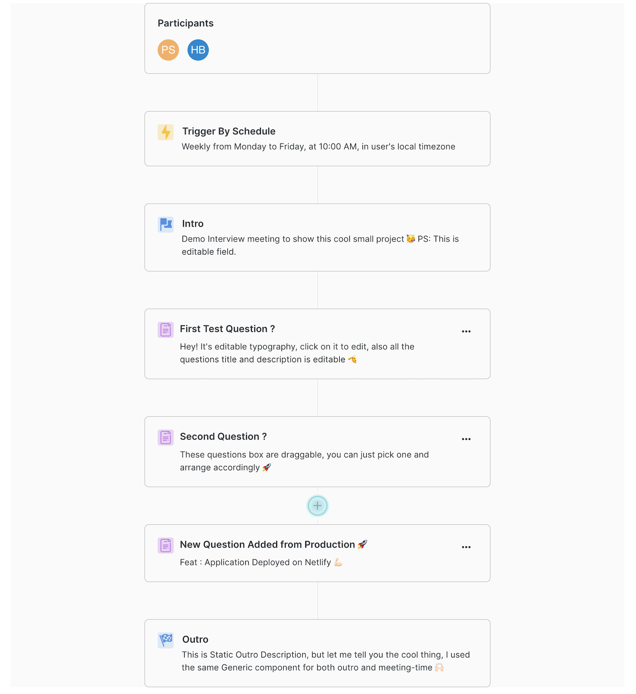

# BetaQueue Interview Task Application



This application is a comprehensive solution for the BetaQueue interview task. It consists of five key components:

1. **Participants:** This section displays a list of participants. The participant data is fetched from a Superbase table.

2. **Meeting Details:** This section provides crucial information about the meeting such as date, time, location, and agenda.

3. **Introduction:** The introduction section contains a static title and a dynamic description. Users can seamlessly edit the description by simply clicking on the text. Any changes made are promptly stored in the Superbase database, ensuring the most up-to-date information is available.

4. **Questions:** Users have the ability to add questions dynamically. By hovering over the divider between the Introduction and Outro components, a convenient "Add" button appears. Clicking this button opens a modal where users can input both a title and description for their question. Upon submission, a new question component is created. Additionally, users can easily edit the title or description by clicking on them, converting them into input fields. Any changes made are instantly reflected in both the user interface and the database. Questions can also be removed by clicking on the vertical ellipsis, revealing a menu with the option to delete.

5. **Outro:** This section marks the conclusion of the application, providing closing remarks or additional information.

## Additional Features

One standout feature of this application is the ability to effortlessly rearrange questions. Through a simple drag-and-drop interface, users can reorder questions to suit their preferences.

## Technologies Utilized

- **ReactJS:** The application is built using ReactJS, providing a robust and efficient user interface.

- **Material UI:** The UI is designed with Material UI, offering a clean and modern aesthetic.

- **Superbase:** The Superbase platform is employed for both the database and backend operations, ensuring seamless data management.

- **Netlify:** The application is deployed on Netlify, providing a reliable and accessible platform for users.

## Getting Started

To run the application locally, follow these steps:

1. Clone the repository to your local machine.

   ```bash
   git clone https://github.com/your-username/betaqueue-interview-task.git
   ```

2. Navigate to the project directory.

   ```bash
   cd betaqueue-interview-task
   ```

3. Install the required dependencies.

   ```bash
   npm install
   ```

4. Start the application.

   ```bash
   npm start
   ```

Please ensure you've set the following environment variables:

- `REACT_APP_SUPERBASE_URL`
- `REACT_APP_SUPERBASE_KEY`

## Accessing the App

If you'd like to access the application without running it locally, it's conveniently deployed on Netlify. You can [visit the app here](https://dynamic-duckanoo-a309b7.netlify.app/).

Feel free to explore the application and make use of its features. If you have any questions or feedback, please don't hesitate to reach out!

![Thank you - Praveen Sharma]
